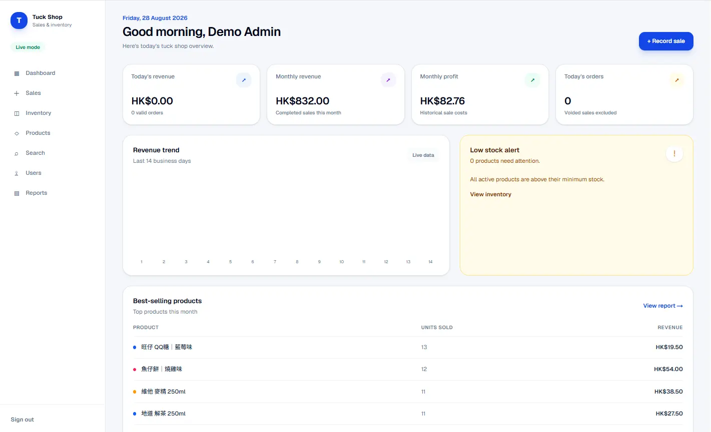
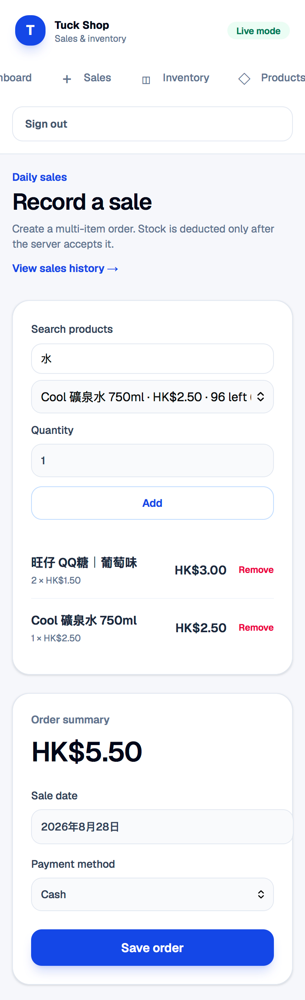

# 小賣部銷售及庫存管理系統

繁體中文（zh-TW）文件。本專案的英文文件請參閱：[README.md](./README.md)。

這是一個以 Next.js 16 和 Supabase 建立的小賣部 Keeper／POS 系統，用於記錄銷售、管理庫存、維護結構化產品目錄，以及匯出報表。

## 專案目前狀態

V1 已部署到 Vercel，並連接 production Supabase。production 歷史銷售替換已於 2026-08-13 完成並驗證：

- 57 個啟用中的產品（`HK-001` 至 `HK-057`）
- 2026-06-01 至 2026-08-12 共 295 筆生成銷售
- 573 筆銷售項目、共 1,164 件
- 按 production 現行售價計算，總額為 HK$4,470.50
- 現金 171 筆，電子付款 124 筆
- 歷史替換沒有扣減目前庫存
- production smoke check 通過：`/login` 回傳 200，未登入的報表匯出回傳 403

替換流程保留了原有庫存基準。Migration `202608180001` 已在不改變目前庫存的情況下記錄 10 個已核准的舊 opening balances；Production inventory-ledger mismatch 現為 0。

Release hardening migration `202608180002` 已通過 fresh local migration reset 及完整本機 integration gate，但本文件尚未確認它已套用至 production database。標記完成前，必須先建立並驗證 production backup、在獨立 test project rehearsal、套用 migration，然後執行 production smoke check。

## 畫面截圖

### Admin Dashboard



### 手機版銷售 POS

<p align="center">
  
</p>

## 主要功能

- Supabase email/password 登入，以及 Admin／Staff 角色
- 按角色顯示導覽和保護路由
- 結構化產品資料：SKU、中／英文名稱、品牌、分類、口味、規格、包裝類型、售價、成本、庫存、重訂貨水平、條碼
- 自動產生中文顯示名稱，例如 `卡樂B 薯片 25g｜燒烤味`
- Admin 產品新增、編輯、啟用／停用、安全刪除確認、搜尋、分類及庫存篩選
- 多產品銷售、伺服器端價格快照、可重試 client request ID、每日訂單編號、Admin 作廢
- 入貨、庫存調整、低庫存檢視及庫存變動歷史
- Dashboard、篩選報表、全域搜尋，以及三頁 ExcelJS 匯出
- Row-level security、安全 Staff views、原子 RPC、audit movements 及 release smoke check

## 技術架構

- Next.js 16 App Router、React 19
- TypeScript、Tailwind CSS、shadcn/ui、React Hook Form、Zod
- Supabase Auth、PostgreSQL、RLS、資料庫函式及 migrations
- Vitest 單元及 policy 測試
- pnpm 11、Node.js 20 或以上

## 本機安裝

需要 Node.js 20 或以上、pnpm、Docker Desktop（本機 Supabase），以及一個用於真實資料的 Supabase project。

```powershell
pnpm install
Copy-Item .env.example .env.local
pnpm dev
```

開啟 [http://localhost:3000](http://localhost:3000)。如果 Supabase 變數留空，應用程式會使用唯讀 demo data；demo data 永遠不是 production 資料。

### 環境變數

本機真實值放在 `.env.local`，部署時放在相應的 Vercel environment。不要提交 `.env.local`。

```text
NEXT_PUBLIC_SUPABASE_URL=https://<project-ref>.supabase.co
NEXT_PUBLIC_SUPABASE_ANON_KEY=...
BUSINESS_TIMEZONE=Asia/Hong_Kong
```

`/users` 的 Admin 建立帳戶流程另外需要只可在伺服器使用的 key：

```text
SUPABASE_SECRET_KEY=sb_secret_...
```

仍支援舊名稱 `SUPABASE_SERVICE_ROLE_KEY`。Secret key 絕對不能加上 `NEXT_PUBLIC_`、送到瀏覽器，或提交到 Git。

## 資料庫及 migrations

資料庫的真實來源是 `supabase/migrations/` 內按順序排列的 migration。內容包括基礎 schema、RLS 及 grants、產品目錄資料、歷史匯入保護、結構化產品欄位、HK 產品對照、安全銷售歷史替換、deterministic backup hashes、庫存保護，以及 `202608180002` 的 payload-bound retry／權限 hardening。

本機資料庫：

```powershell
pnpm dlx supabase@latest start
pnpm dlx supabase@latest db reset
```

`db reset` 會清除本機 Supabase 資料庫，並重新套用 migrations 及 `supabase/seed.sql`。不要在 production 執行 seed file。

連接 linked remote project 時，先檢查 migration 清單，並在建立 backup 後才 push：

```powershell
pnpm dlx supabase@latest migration list
pnpm dlx supabase@latest db push
```

Production 前請先用另一個 remote/test project rehearsal。已套用到 remote 的 migration 不要直接修改，應新增一個 migration。

### 建立第一個 Admin

建立 Auth user 時，應用程式不會自動建立 profile。請只在受信任的 Supabase Dashboard 執行一次以下 bootstrap：

1. 開啟 **Authentication → Users**，建立第一個 user、確認 email，然後複製 user UUID。
2. 在 **SQL Editor** 確認 UUID 及 email 是預期帳戶：

```sql
select id, email
from auth.users
where id = '<FIRST_ADMIN_AUTH_USER_UUID>'::uuid;
```

3. 使用相同 UUID 建立啟用中的 Admin profile：

```sql
insert into public.profiles (id, name, role, is_active)
values ('<FIRST_ADMIN_AUTH_USER_UUID>'::uuid, 'First Admin', 'admin', true)
on conflict (id) do update
set name = excluded.name,
    role = excluded.role,
    is_active = excluded.is_active;
```

4. 使用該帳戶登入並驗證 `/users`。之後的 Admin 和 Staff 帳戶全部從該頁建立。不要在瀏覽器程式碼公開 service-role 或 secret key。

## 結構化產品目錄

產品的既有 ID 和 SKU 不會改變。需求文件使用業務名稱；現有專案保留原本的資料庫命名：

| 業務含義 | 資料庫／應用程式欄位 |
|---|---|
| SKU | `product_code` |
| 中、英文名稱 | `name_zh`、`name_en` |
| 品牌、分類、口味、規格、包裝及條碼 | `brand`、`category`、`flavour`、`size`、`package_type`、`barcode` |
| 售價 | `selling_price` |
| 成本 | `cost_price` |
| 庫存數量 | `current_stock` |
| 重訂貨水平 | `minimum_stock` |

應用程式會由欄位產生顯示名稱，而不是在每個表單或 POS 卡片重複儲存一條很長的名稱。搜尋支援 SKU、中／英文名稱、品牌、分類、口味及條碼。啟用中的 HK 產品對照在 `202608120002_catalogue_mapping.sql`。

## 歷史銷售匯入

歷史匯入工具預設為 dry-run。請把來源 TSV 保留在本機且不要追蹤，先檢查 JSON preview，再核對總額及產品對應後才 apply：

```powershell
pnpm import:historical -- --input .\historical-sales-2025.tsv
$env:SUPABASE_SECRET_KEY = "sb_secret_..."
pnpm import:historical -- --input .\historical-sales-2025.tsv --apply
```

匯入工具使用 deterministic IDs，按日期及付款方式分組，未能配對的產品會保留為停用歷史產品，而且不會扣減目前庫存。舊名稱 `SUPABASE_SERVICE_ROLE_KEY` 仍可作 fallback。

## 替換一段銷售歷史

`pnpm replace:sales-history` 是 destructive production 工具，固定處理 2026-06-01 至 2026-08-12。它要求 target-specific confirmation、service-role 權限、凍結 backup，以及已開啟的 maintenance window。

先永遠執行 dry-run：

```powershell
pnpm replace:sales-history
pnpm replace:sales-history --status
```

Production cutover 順序：

1. 先在測試 project 套用並驗證 migrations，再建立 production pre-migration backup。
2. 使用 `--status` 顯示的 target-bound command 開啟 maintenance。
3. maintenance 開啟期間，用 Supabase CLI 建立 `roles.sql`、`schema.sql` 和 `data.sql`。
4. 建立 manifest，寫入 project ref、maintenance timestamp、sales/items/movement/counter 精確數字、canonical hashes，以及三份檔案的 SHA256。
5. 使用 `--confirm DELETE-ALL-SALES:<project-ref> --backup-manifest <path>` 執行 apply。
6. 檢查回傳的筆數、payload hash、counter check 和 ledger baseline。
7. 使用 `--status` 顯示的 target-bound command 關閉 maintenance。

替換是 atomic operation。期間會阻擋銷售、產品、庫存及相關寫入，不會扣減目前庫存，會保留 inventory ledger 總和，並在插入後驗證已落盤資料。如果 apply 失敗，保持 maintenance 開啟，先執行 `--status` 和調查，確認後才執行 target-bound maintenance-off command。

請永久保存 frozen backup。替換會把舊 sale movements 從 live ledger 移除，並以 reconciliation movement 保留總影響；原本逐筆歷史必須依靠已驗證的 backup 還原。

## 本機 Supabase 驗證

Docker Desktop 執行中時，啟動本機 stack 並載入自動產生的 test keys：

```powershell
pnpm dlx supabase@latest start
$status = pnpm dlx supabase@latest status -o json | ConvertFrom-Json
$env:SUPABASE_TEST_URL = $status.API_URL
$env:SUPABASE_TEST_ANON_KEY = $status.ANON_KEY
$env:SUPABASE_TEST_SERVICE_ROLE_KEY = $status.SERVICE_ROLE_KEY
pnpm verify:local
```

`verify:local` 會建立暫時本機 users 和 fixtures，測試 RLS 及 RPC 權限、actor-less ledger 約束、atomicity、payload-bound retry、concurrency、oversell protection、void safety、庫存匯入 idempotency 及 Staff restrictions，然後清理 fixtures。絕對不要把 production URL 傳給它。

Sales replacement integration check 只會在執行前後 reset 本機 Supabase：

```powershell
pnpm verify:sales-replacement
```

它會驗證 malformed payload rollback、maintenance locking、direct-write blocking、deterministic hashes、精確筆數及 ledger reconciliation。如果 `pnpm dlx` 無法下載 CLI，可先把 `SUPABASE_CLI_PATH` 設為現有本機 `supabase` executable 的路徑，再執行指令。

## Checks 及 release smoke test

```powershell
pnpm typecheck
pnpm lint
pnpm test
pnpm build
```

完成 `pnpm build` 及 `pnpm start` 後，執行公開 HTTP smoke check：

```powershell
pnpm smoke:app
```

測試 Vercel Preview 或 production 時設定 `SMOKE_BASE_URL`。檢查內容包括公開登入頁、未登入的報表匯出授權，以及必要的 security headers。

Reports 頁支援 `month`、`from`、`to`、`paymentMethod`、`status`、`product`、`category` 和 `staff` 篩選。Demo mode 是唯讀的。

## Deployment、backup 及 recovery

1. 將已 review 的 commit push 到 GitHub，等待 Vercel deployment 完成。
2. 在需要的 Vercel environments 設定 `NEXT_PUBLIC_SUPABASE_URL`、`NEXT_PUBLIC_SUPABASE_ANON_KEY` 和 `BUSINESS_TIMEZONE`。
3. 只有需要伺服器端 Admin 建立帳戶流程時才設定 `SUPABASE_SECRET_KEY`。
4. 建立並驗證 backup 後才套用 Supabase migrations。Production 絕對不要執行 `supabase/seed.sql`。
5. 對 deployment 執行 `SMOKE_BASE_URL` smoke check，並分別驗證 Admin 和 Staff session。
6. Recovery 時，先把已驗證 backup 還原到另一個 Supabase project，在該 project 套用 migrations；如有 key 外洩則 rotate keys，更新 Vercel variables，完成 smoke check 後才切換流量。

## 文件

- [English README](./README.md)
- [Development plan](./DEVELOPMENT_PLAN.md)
- [Project specification](./project%20prompt.md)
- [Environment template](./.env.example)

## 已知後續工作

- 把 production backup manifests 和 restore rehearsal 永久保留為 release evidence。
- `pnpm audit --prod` 在將 `nanoid` 固定為 `3.3.18`、ExcelJS 的 `uuid` 固定為 `11.1.1` 後，實際結果為沒有已知 production vulnerabilities；ExcelJS workbook smoke check 亦已通過。
